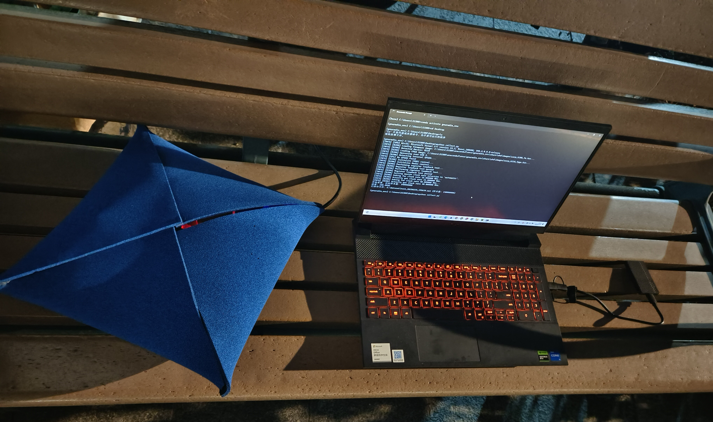

# DRFF-R1 Dataset Description

## Language Selection
- [English](README.en.md)
- [中文](README.md)

## 1. Equipment Introduction

### 1. Drones and Flight Controllers  
This dataset uses DJI drones and their flight control systems, covering 20 drones across 7 models:  
- 1 × Mavic Mini  
- 1 × Mavic Air  
- 1 × Mavic 3  
- 3 × Mini SE  
- 3 × Mini 3 Pro  
- 5 × Mavic Air 2  
- 6 × Mavic Air 2S  

### 2. RF Signal Receiver  
The RF signal reception device is the USRP-B210 from Ettus Research. Key specifications:  
- Frequency range: 70 MHz - 6 GHz  
- 2 TX / 2 RX channels  
- Maximum instantaneous bandwidth: 56 MHz  
- Signal gain: 0-90 dB  
- Maximum I/Q sampling rate: 61.44 MS/s  

### 3. Data Cable  
The data cable connecting the host and USRP is an E164571-KS AWM 2725, supporting up to 5 GB/s transfer rate with latency <10 ms.  

### 4. Host Computer  
The host runs Windows 11 with an Intel(R) Core(TM) i5-13450HX CPU, 16 GB RAM, and a 2 TB portable HDD for storage.  
A GNU Radio environment is installed to drive the USRP for signal acquisition and data I/O.  

## 2. Dataset  

### Naming Convention  
Taking `mini_3pro_1_0.mat` as an example:  
- `mini_3pro`: Drone model  
- `1`: The 1st drone of this model  
- `0`: Collection distance  
  - `0`: Baseline signal in an anechoic chamber (no EMI)  
  - `10`, `30`, `50`, `70`, `90`: Hovering distances (meters)  

### Dataset Content  
Each `.mat` file contains:  
- 140 million In-phase (I) and Quadrature (Q) signal samples  
- Sampling frequency (`Fs`)  
- Center frequency (`CenterFreq`)  

For detailed collection workflow, refer to `collect.py`.  

### Data Collection Strategy  
During outdoor hovering signal collection (at 10m/30m/50m/70m/90m altitudes), the UAV radio frequency signals can produce multipath effects due to environmental reflections. To eliminate channel interference, we place the USRP receiver, a normally connected UAV, and the flight controller together under RF signal wave-absorbing cotton wrapping condition. This cotton effectively absorbs electromagnetic waves in the 5-6 GHz frequency band (reflection attenuation >30 dB). A schematic diagram is shown below: 

  

Signals collected in the absorption cotton (labeled `0m`) serve as baseline data unaffected by multipath/Doppler effects. Users may simulate complex scenarios by superimposing channel models (e.g., Rayleigh fading, multipath delay) onto these baseline signals. Real-world hovering data (labeled ≥10m) can directly validate models in practical environments.  

## 3. Collection Workflow  

Two operators are required: Operator A controls the drone, Operator B manages the host.  

1. **Operator A**:  
   - Powers on the drone near the host and places it in standby mode, connecting to a calibrated remote controller or mobile app.  
   - Maintains drone hovering at specified distances (anechoic chamber, 10m, 30m, 50m, 70m, 90m), with real-time distances monitored via the app.  

2. **Operator B**:  
   - Executes Python scripts to connect the host with USRP-B210 via the data cable.  
   - Configures default parameters:  
     - Sampling rate: 40 MS/s  
     - Center frequency: 5.745 GHz (all drones manually set to Channel 149 for consistency across OcuSync 2.0/3.0 variants)  
     - Gain: 30 dB  
     - Bandwidth: 20 MHz  
   - Collects 140 million samples per file, labels files following naming rules, and verifies data integrity.  
   - Signals Operator A to land the drone after completion, then repeats for other drones.  

- **Schematic**:  

  

---  

## 4. Data Visualization  

### Plotting Amplitude and Time-Frequency Diagrams  
To visualize amplitude plots and spectrograms, modify the file path in `plot.py`:  
```matlab  
data = load('./mini_se_3_0.mat');  
```
### Mini SE 3 
- **I/Q Amplitude Graph and Time-Frequency Graph of data acquired under RF signal wave-absorbing cotton wrapping**

 

---
