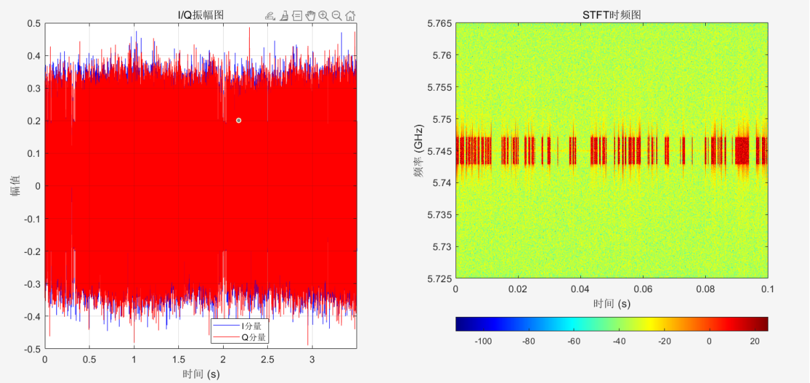
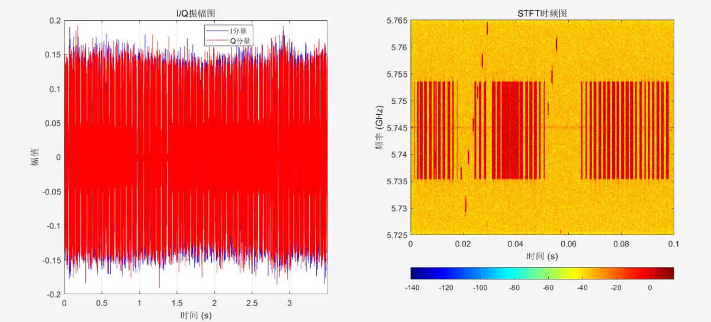

# DRFF-R1 Dataset Description

## Language Selection 
- [Chinese](README.md)
- [English](README.en.md)

## I. Equipment Introduction
### 1. Drones and Flight Controllers
This dataset utilizes DJI drones and their flight control systems, covering 7 different models with a total of 20 drones, specifically:
- 1 Mavic Mini
- 1 Mavic Air
- 1 Mavic 3
- 3 Mini SE
- 3 Mini 3 Pro
- 5 Mavic Air 2
- 6 Mavic Air 2S

### 2. RF Signal Receiver
The RF signal receiver used in this dataset is the USRP-B210 from Ettus Research. Its main specifications are as follows:
- Frequency range: 70 MHz - 6 GHz
- Supports 2 TX, 2 RX
- Maximum instantaneous bandwidth: 56 MHz
- Signal gain: 0～90 dB
- Maximum I/Q sampling rate: 61.44 MS/s

### 3. Connection Cable
The data transfer cable connecting the host and the USRP device is the E164571-KS AWM 2725, which supports a maximum transfer rate of 5 GB/s and has a data transfer delay of less than 10 ms.

### 4. Host
The host runs the Windows 11 operating system, equipped with an Intel(R) Core(TM) i5-13450HX processor, 16 GB of memory, and a 2 TB external hard drive for data storage. The system is installed with the GNU environment to drive the USRP device and achieve signal acquisition and data read/write operations.

## II. Data Collection Process
Data collection requires two personnel: Person A operates the drone, and Person B operates the host.

1. **Person A**:
   - Power on the drone near the host to enter standby mode, and connect it to the calibrated remote controller or mobile app to ensure a normal connection.
   - Operate the drone to enter a hovering state. The real-time distance between the drone and the receiver is provided by the mobile app interface. The collection process is divided into six scenarios: low-noise collection inside anechoic foam, and hovering at distances of 10m, 30m, 50m, 70m, and 90m.

2. **Person B**:
   - Open the Python script and establish a connection with the USRP-B210 via PCIe.
   - Set the default acquisition parameters in the script interface as follows:
     - Sampling rate: 40 MS/s
     - Center frequency: 5.745 GHz (Considering different drones use different video transmission technologies such as OcuSync 2.0, OcuSync 3.0, etc., the drone's video transmission channel is manually set to Channel 149 during actual collection)
     - Gain: 30 dB
     - Bandwidth: 20 MHz
   - Name the file according to the rules as a data label, and after confirming no errors, run the script to enter the data collection mode. Each collection generates a signal segment containing 140 million samples. After completing one segment, rename the file and proceed to the next segment.
   - After the collection is complete, signal Person A to safely land the drone.

- **The schematic diagram is as follows:**

 

---
## III. Dataset
### Dataset Naming Convention
Taking `mini_3pro_1_0.mat` as an example:
- `mini_3pro`: Represents the drone model
- `1`: Indicates the 1st drone of this model
- `0`: Represents the collection distance
  - `0`: The reference signal collected inside anechoic foam with no external electromagnetic interference
  - `10`, `30`, `50`, `70`, `90`: Represent the drone hovering at distances of 10m, 30m, 50m, 70m, and 90m, respectively

### Data File Content
Each `.mat` file contains:
- 140 million samples of in-phase signal (I) and quadrature signal (Q)
- Sampling frequency (Fs)
- Center frequency (CenterFreq)

For detailed collection procedures, please refer to the code `collect.py`.

## IV. Data Visualization
### Plotting Amplitude and Time-Frequency Graphs
For each `.mat` file, you can use MATLAB to plot amplitude and time-frequency graphs. The specific code can be found in `plot.py`. Just modify the following code to the actual file path:
```matlab
data = load('./mini_se_4_0.mat');
```
Sample graphs are as follows：

### Mini SE 3 
- **I/Q Amplitude Graph and Time-Frequency Graph of data acquired under RF signal wave-absorbing cotton wrapping**

 

---

### Mini SE 4
- **I/Q Amplitude Graph and Time-Frequency Graph of data acquired under RF signal wave-absorbing cotton wrapping**

 

---

### Mavic Air 2S 1
- **I/Q Amplitude Graph and Time-Frequency Graph of data acquired under RF signal wave-absorbing cotton wrapping**

  

---

### Mavic Air 2S 2
- **I/Q Amplitude Graph and Time-Frequency Graph of data acquired under RF signal wave-absorbing cotton wrapping**

 

---
