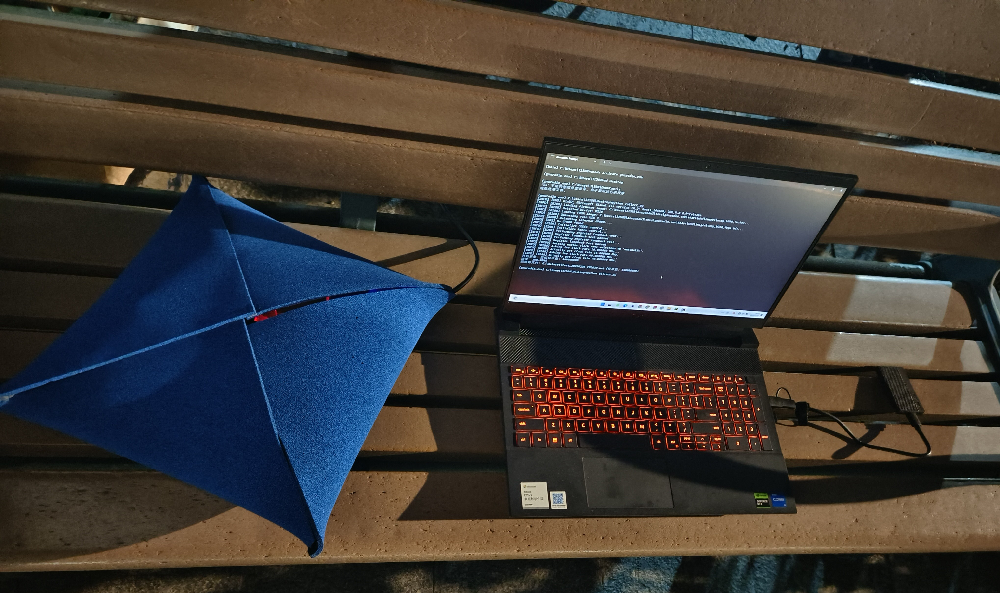
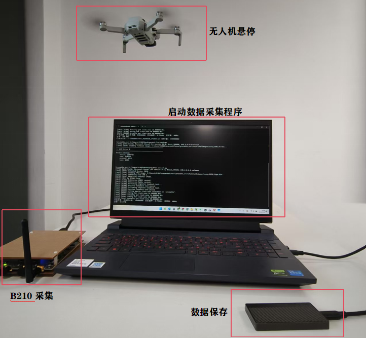

# DRFF-R1 数据集说明

## 语言选择
- [English](README.en.md)
- [中文](README.md)
  
## 一、设备介绍

### 1. 无人机与飞控器
本数据集使用 DJI 无人机及其飞控器，涵盖 7 种机型共 20 台无人机，具体包括：
- 1 台 Mavic Mini
- 1 台 Mavic Air
- 1 台 Mavic 3
- 3 台 Mini SE
- 3 台 Mini 3 Pro
- 5 台 Mavic Air 2
- 6 台 Mavic Air 2S

### 2. 射频信号接收机
本数据集使用的射频信号接收设备为 Ettus Research 公司推出的 USRP-B210。其主要参数如下：
- 频率接收范围：70 MHz - 6 GHz
- 支持 2 发 2 收（2 TX, 2 RX）
- 最大瞬时带宽：56 MHz
- 信号增益：0～90 dB
- 最大 I/Q 采样率：61.44 MS/s

### 3. 连接线
连接主机与 USRP 设备的数据传输线采用 E164571-KS AWM 2725，支持最高 5 GB/s 传输速率，数据传输延迟小于 10 ms。

### 4. 主机
主机运行 Windows 11 操作系统，搭载 Intel(R) Core(TM) i5-13450HX 处理器，配备 16 GB 内存和 2 TB 移动硬盘用于数据存储。
系统安装了 GNU 环境，以驱动 USRP 设备，实现信号采集与数据读写。

## 二、数据集

### 数据集命名规则
以 `mini_3pro_1_0.mat` 为例：
- `mini_3pro`：代表无人机型号
- `1`：代表该型号中的第 1 台无人机
- `0`：代表采集距离
  - `0`：在吸波棉包裹下的基准信号，无外界电磁干扰
  - `10`、`30`、`50`、`70`、`90`：分别代表无人机悬停位置为 10m、30m、50m、70m、90m

### 数据集内容
每一个 `.mat` 文件中包含：
- 同相信号（I）和正交信号（Q）各 1.4 亿个
- 采样频率（Fs）
- 中心频率（CenterFreq）

详细采集流程请参考代码 `collect.py`。

### 数据集采集方案
在户外悬停信号采集中（10m/30m/50m/70m/90m），无人机射频信号会因环境反射产生多径效应。为消除信道干扰，我们将USRP接收机、处于正常连接状态的无人机和飞控器共同置于吸波棉屏蔽腔体内进行基准信号采集，吸波棉可有效吸收 5-6 GHz 频段的电磁波（反射衰减 >30 dB）,示意图如下：

 

数据集使用时可将吸波棉包裹条件下采集的信号（距离标记为0m的数据文件）作为基准信号，该信号未受多径效应和多普勒效应影响。
您可以通过仿真手段在此基准信号上叠加不同信道模型（如瑞利衰落、多径延迟等），构建复杂场景下的训练数据集。
同时，真实悬停场景采集的数据（距离标记≥10m）可直接用于实际环境下的模型验证。

## 三、采集流程

数据采集需两名人员，人员 A 操纵无人机，人员 B 操作主机。

1. **人员 A**：
   - 在主机附近打开无人机进入待机状态，并将其与校准遥控器或手机端应用相连接，确认连接正常。
   - 操作无人机进入悬停状态，无人机离接收机实时距离由手机应用界面提供，采集过程划分为：吸波棉内低噪声采集，10m, 30m, 50m, 70m, 90m 六种。

2. **人员 B**：
   - 打开 Python 例程，通过数据传输线使 主机 与 USRP-B210 正常连接。
   - 在例程操作界面，设置默认采集参数如下：
     - 采样率：40 MS/s
     - 中心采样率：5.745 GHz（考虑到不同无人机型号会采用诸如 OcuSync 2.0，OcuSync 3.0 等不同图传技术，在实际采集时将无人机图传信道均手工设置为 149 信道）
     - 增益：30 dB
     - 带宽：20 MHz
   - 运行例程进入数据采集模式，每次采集的信号片段包含 1.4 亿个采样点，当前片段采集完毕后按规则命名文件作为数据标签。
   - 确认无误后，进入下一个片段采集。
   - 当前无人机的全部信号片段采集完毕后，示意人员 A 操作无人机安全降落。
   - 更换另一台无人机重复上述操作，直至全部无人机射频信号采集完毕。

- **示意图如下**

     

---

## 四、数据效果


### 绘制振幅图与时频图
如果您希望查看数据振幅图与时频图，可以参考代码 `plot.py`，针对每一个 `.mat` 文件，您只需修改以下代码为实际文件路径即可：
```matlab
data = load('./mini_se_3_0.mat');
```
绘制的样例图如下：

### Mini SE 3
- **吸波棉内采集数据 I/Q 振幅图与时频图**

 

---
