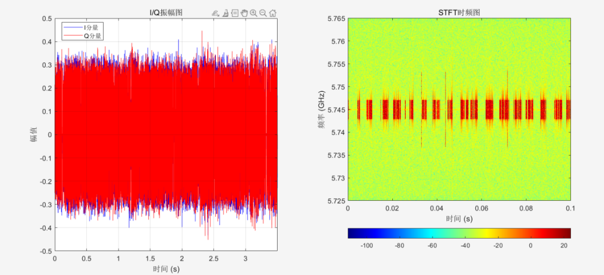
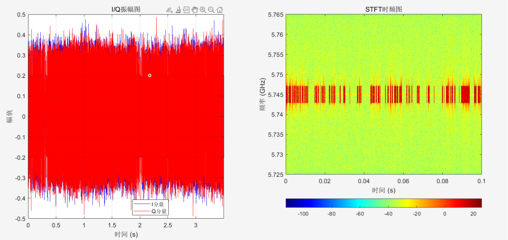
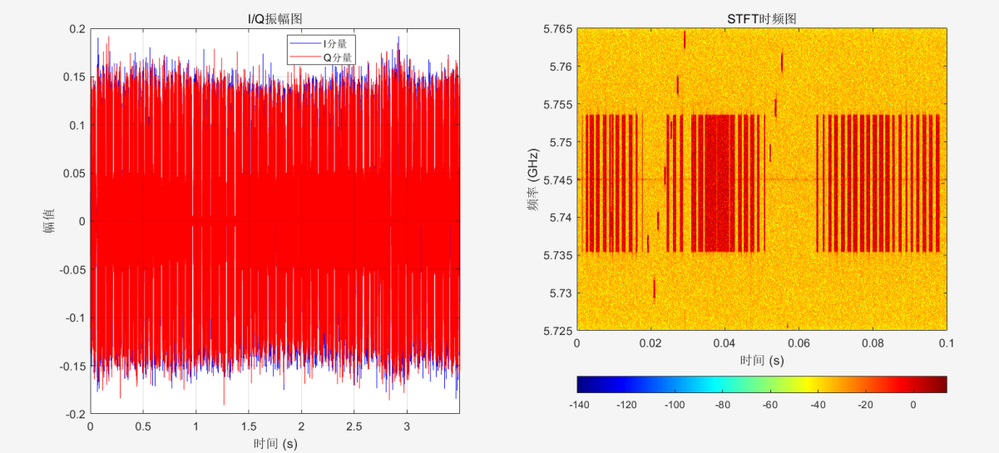
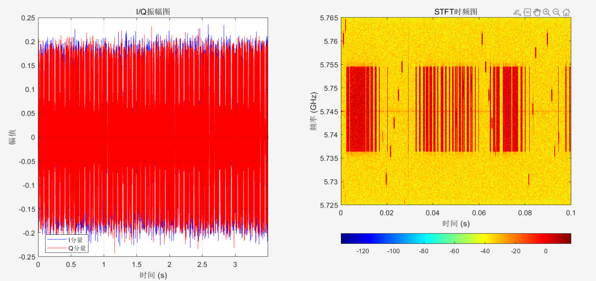

# DRFF-R1 数据集说明

## 一、设备介绍

### 1. 无人机与飞控器
本数据集使用 DJI 无人机及其飞控系统，涵盖 7 种机型共 20 台无人机，具体包括：
- 1 台 Mavic Mini
- 1 台 Mavic Air
- 1 台 Mavic 3
- 3 台 Mini SE
- 3 台 Mini 3 Pro
- 5 台 Mavic Air 2
- 6 台 Mavic Air 2S

### 2. 射频信号接收机
本数据集使用的射频信号接收设备为 Ettus Research 公司推出的 USRP-B210。其主要参数如下：
- 频率接收范围：70 MHz - 6 GHz
- 支持 2 发 2 收（2 TX, 2 RX）
- 最大瞬时带宽：56 MHz
- 信号增益：0～90 dB
- 最大 I/Q 采样率：61.44 MS/s

### 3. 连接线
连接主机与 USRP 设备的数据传输线采用 E164571-KS AWM 2725，支持最高 5 GB/s 传输速率，数据传输延迟小于 10 ms。

### 4. 主机
主机运行 Windows 11 操作系统，搭载 Intel(R) Core(TM) i5-13450HX 处理器，配备 16 GB 内存和 2 TB 移动硬盘用于数据存储。系统安装了 GNU 环境，以驱动 USRP 设备，实现信号采集与数据读写。

## 二、采集流程

数据采集需两名人员，人员 A 操纵无人机，人员 B 操作主机。

1. **人员 A**：
   - 在主机附近打开无人机进入待机状态，并将其与校准遥控器或手机端应用相连接，确认连接正常。
   - 操作无人机进入悬停状态，无人机离接收机实时距离由手机应用界面提供。采集过程划分为：吸波棉内低噪声采集，10m, 30m, 50m, 70m, 90m 六种。

2. **人员 B**：
   - 打开 Python 例程，通过 PCIe 使其与 USRP-B210 连接正常。
   - 在例程操作界面，设置默认采集参数如下：
     - 采样率：40 MS/s
     - 中心采样率：5.745 GHz（考虑到不同无人机型号会采用诸如 OcuSync 2.0，OcuSync 3.0 等不同图传技术，在实际采集时将无人机图传信道手工设置为 149 信道）
     - 增益：30 dB
     - 带宽：20 MHz
   - 按规则命名文件作为数据标签，确认无误后运行例程进入数据采集模式，每次采集生成信号片段包含采样点为 1.4 亿个。采集完毕一个片段，重新命名文件名，进入下一个片段采集。
   - 采集完毕后，示意人员 A 操作无人机安全降落。

## 三、数据集

### 数据集命名规则
以 `mini_3pro_1_0.mat` 为例：
- `mini_3pro`：代表无人机型号
- `1`：代表该型号中的第 1 台无人机
- `0`：代表采集距离
  - `0`：在吸波棉包裹下的基准信号，无外界电磁干扰
  - `10`、`30`、`50`、`70`、`90`：分别代表无人机悬停位置为 10m、30m、50m、70m、90m

### 数据文件内容
每一个 `.mat` 文件中包含：
- 同相信号（I）和正交信号（Q）各 1.4 亿个
- 采样频率（Fs）
- 中心频率（CenterFreq）

详细采集流程请参考代码 `collect.py`。

## 四、数据效果


### 绘制振幅图与时频图
针对每一个 `.mat` 文件，你可以使用 MATLAB 绘制振幅图与时频图，具体代码可以参考 `plot.py`，只需修改以下代码为实际文件路径：
```matlab
data = load('./mini_se_4_0.mat');
```
绘制的样例图如下：

### Mini SE 3
- **吸波棉内采集数据 I/Q 振幅图与时频图**

 

---

### Mini SE 4
- **吸波棉内采集数据 I/Q 振幅图与时频图**

 

---

### Mavic Air 2S 1
- **吸波棉内采集数据 I/Q 振幅图与时频图**

  

---

### Mavic Air 2S 2
- **吸波棉内采集数据 I/Q 振幅图与时频图**

 

---
